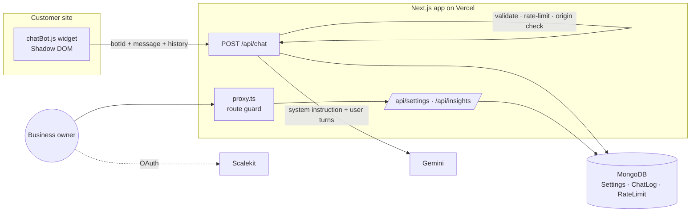

# Support.ai

**Embeddable, multi-tenant AI customer-support chatbot.** A business signs in, pastes its FAQs and
policies into a dashboard, and drops a single `<script>` tag on its website. Visitors get instant
answers grounded in *that business's* knowledge, and the owner gets analytics showing which questions
the bot couldn't answer, so the knowledge base improves over time.

> 🔗 **Live demo:** _add your Vercel URL_ &nbsp;·&nbsp; 🎥 **Demo GIF:** _add a screen recording of the widget on a sample page_

```html
<script src="https://YOUR_APP/chatBot.js" data-bot-id="YOUR_BOT_ID"></script>
```

## Features

- **Drop-in widget**: one script tag; renders in a **Shadow DOM** (no CSS/ID clashes with the host page), keyboard and screen-reader friendly, keeps short conversation history.
- **Grounded answers**: Gemini answers *only* from the tenant's knowledge base and returns structured output (`{answer, answered}`), so "I don't know" is detected reliably instead of guessed from text.
- **Insights dashboard**: answer rate, 14-day volume chart, and a queue of **unanswered questions** to fix ("mark resolved" workflow).
- **Multi-tenant isolation**: OAuth login (Scalekit); every dashboard API derives identity from the session; the public widget uses a separate random `botId`.
- **Per-tenant domain allowlist** (`example.com`, `*.example.com`).
- **Abuse protection**: MongoDB-backed rate limits (per visitor and per bot) that hold across serverless instances.
- **Data retention**: chat logs auto-expire after 90 days via a TTL index.

## Architecture



**Chat request pipeline** (`src/app/api/chat/route.ts`): Zod validation → per-visitor rate limit → bot lookup →
origin allowlist → per-bot rate limit → Gemini (15 s timeout, JSON schema) → log (best-effort) → reply.

## Security model

| Threat | Mitigation |
|---|---|
| Reading/overwriting another tenant's settings (IDOR) | Owner ID comes from the validated session, never the request body. Covered by tests. |
| Mongo operator injection (`{"botId":{"$ne":null}}`) | Zod requires plain strings matching a strict regex before any query. Covered by tests. |
| XSS through model output / user text | Widget uses `textContent` only, inside a Shadow DOM. |
| Prompt injection | Rules + business data live in the *system instruction*; customer text is only sent as user turns and is declared untrusted. |
| Cost/abuse of the AI quota | Input length caps, per-IP and per-bot rate limits, bounded output tokens, request timeout. |
| Bot ID reused on other sites | Optional per-tenant origin allowlist (a deterrent, not authentication; see limitations). |
| Login CSRF / session issues | OAuth `state` check, `HttpOnly` + `SameSite=Lax` + `Secure` (prod) cookie, lifetime capped to the token's, POST-only logout. |
| Secrets in logs | Tokens and full error objects are never logged; upstream errors are hidden from clients. |

## Tech stack

Next.js 16 (App Router, `proxy.ts`) · React 19 · TypeScript (strict) · MongoDB + Mongoose · Scalekit (auth) ·
Google Gemini (`@google/genai`) · Zod · Tailwind CSS 4 · Vitest · GitHub Actions

## Getting started

```bash
git clone <your-repo> && cd support-ai
npm install
cp .env.example .env.local   # then fill in values
npm run dev                  # http://localhost:3000
```

| Variable | Purpose |
|---|---|
| `SCALEKIT_ENVIRONMENT_URL`, `SCALEKIT_CLIENT_ID`, `SCALEKIT_CLIENT_SECRET` | Scalekit app credentials. Add `<APP_URL>/api/auth/callback` as an allowed redirect URI. |
| `NEXT_PUBLIC_APP_URL` | Public base URL of the app (used for OAuth redirects and the embed snippet). |
| `MONGODB_URL` | MongoDB connection string (Atlas free tier works). |
| `GEMINI_API_KEY` | Google AI Studio API key. |
| `GEMINI_MODEL` | Optional; defaults to `gemini-2.5-flash`. |

**Deploy:** import the repo into Vercel, set the variables above, and update the Scalekit redirect URI.

## Scripts

| Command | What it does |
|---|---|
| `npm test` | 37 unit/route tests (Vitest) |
| `npm run typecheck` | `tsc --noEmit` |
| `npm run lint` | ESLint |
| `npm run build` | Production build |

CI (`.github/workflows/ci.yml`) runs lint → typecheck → tests → build on every push and PR.

## API

| Method & path | Auth | Description |
|---|---|---|
| `POST /api/chat` | public (botId) | `{botId, sessionId, message, history[]}` → `{reply, answered}`. 400/403/404/429/502 on error with `{error}`. |
| `GET/PUT /api/settings` | session | Read / update business info, knowledge base, allowed domains. |
| `GET /api/insights` | session | 30-day totals, answer rate, 14-day series, unanswered questions. |
| `PATCH /api/insights` | session | `{id}` → mark an unanswered question resolved (scoped to caller's bot). |
| `GET /api/auth/login`, `GET /api/auth/callback`, `POST /api/auth/logout` | n/a | OAuth flow. |

## Design decisions & trade-offs

- **Separate `botId` from the auth user ID.** The identifier in a public script tag should be revocable and unrelated to the login identity.
- **Mongo-backed rate limiter over in-memory.** Serverless instances don't share memory, so an in-memory limiter silently multiplies the limit. A fixed window on an atomic `$inc` upsert with a TTL index is simple and correct across instances. A sliding window or Redis would be smoother at higher scale.
- **Structured output for "answered".** Asking the model to return `{answer, answered}` is more reliable than regex-matching phrases like "I don't know", and powers the insights feature.
- **Whole knowledge base in the prompt.** Fine for FAQ-sized content (capped at 20k chars). Beyond that, chunking + embeddings + retrieval would be the next step.

## Known limitations / roadmap

- The origin allowlist can be spoofed by non-browser clients; rate limits are the real cost control. Signed short-lived widget tokens would be stronger.
- No refresh-token flow yet: sessions end when the access token expires.
- No streaming responses or human-handoff yet.
- Retrieval (embeddings) for large knowledge bases.

## Migrating from the earlier version

The widget attribute changed from `data-owner-id` to `data-bot-id`. Existing sites must copy the new snippet from the **Embed** page.

## License

MIT
